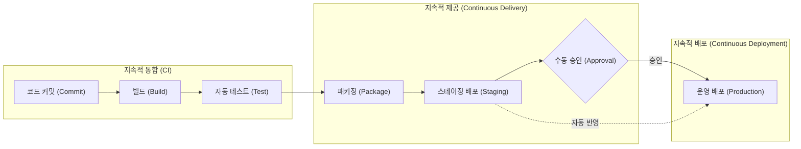

# **mybatis-sns 컨테이너라이징 및 로컬 서비스 검증**

## **1. 컨테이너라이징 사전 작업 (환경 변수 및 시크릿 분리)**

### **1.1 환경 변수 주입 방식**

- 이미지 불변성(Immutable Image) 원칙: 한 번 빌드된 도커 이미지는 로컬, 검증, 운영 환경 어디서나 동일하게 재사용되어야 하므로 특정 환경의 비밀 파일이 이미지 내부에 포함되어서는 안 됨. 특히 소스 트리에 비밀 파일이 남아 있을 경우 `COPY src ./src` 과정에서 JAR 파일 내부에 시크릿이 패키징되어 Docker Hub에 유출되는 보안 사고를 유발함.
- 설정 단일화 및 안전한 보안 관리: `application.yaml`에서는 환경 변수 플레이스홀더(`${...}`)만 참조하도록 단일화하고, 실제 값은 환경별 `.env` 또는 Secrets로 분리하여 관리.
- 런타임 우선순위 바인딩: 스프링 부트는 시스템 환경 변수를 파일 설정보다 최우선으로 반영하므로, 런타임 시점에 .env의 환경별 비밀값을 안전하게 주입.
- 컨테이너 및 클라우드 배포 환경에서는 파일 기반 분리(`application-secret.yaml`, `application-oauth.yaml`) 대신 환경 변수(`.env`) 주입 방식을 채택함.

### **1.2 실습 파일 세부 작성 가이드**

#### **1) `.gitignore` 보안 규칙 추가**

- 환경 변수 파일(`.env*`)의 Git 커밋을 차단하되, 템플릿 파일인 `.env.example`만 예외로 허용.
- 프로젝트 루트 디렉터리의 `.gitignore` 파일 수정

    ```
    # 환경 변수 및 시크릿 파일 유출 차단
    .env*
    !.env.example
    ```


#### **2) `.env.example` 템플릿 파일 작성**

- 어떤 환경 변수 키들이 필요한지 가이드를 제공하며 실제 비밀번호와 시크릿은 비워둠.
- 프로젝트 루트 디렉터리에 `.env.example` 파일 생성

    ```
    # DB 컨테이너 초기화 설정 (MySQL 컨테이너용)
    MYSQL_DATABASE=sns_db
    MYSQL_ROOT_PASSWORD=
    MYSQL_USER=
    MYSQL_PASSWORD=
    
    # DB 접속 정보 (Spring Boot 애플리케이션용)
    DB_HOST=localhost
    DB_PORT=3306
    SPRING_DATASOURCE_USERNAME=
    SPRING_DATASOURCE_PASSWORD=
    
    # JWT
    JWT_SECRET=
    
    # OAuth2 클라이언트 자격 증명
    GOOGLE_CLIENT_ID=
    GOOGLE_CLIENT_SECRET=
    KAKAO_CLIENT_ID=
    KAKAO_CLIENT_SECRET=
    ```


#### **3) `.env` 로컬 개발 전용 파일 작성**

- 로컬 개발자가 `.env.example`을 복사하여 생성하며 로컬 테스트용 비밀번호 및 OAuth 키를 입력.
- 프로젝트 루트 디렉터리에 `.env` 파일 생성

    ```
    # DB 컨테이너 초기화 설정 (MySQL 컨테이너용)
    MYSQL_DATABASE=sns_db
    MYSQL_ROOT_PASSWORD=Sns1234!
    MYSQL_USER=sns-app
    MYSQL_PASSWORD=Sns1234!
    
    # DB 접속 정보 (Spring Boot 애플리케이션용)
    DB_HOST=localhost
    DB_PORT=3306
    SPRING_DATASOURCE_USERNAME=sns-app
    # yaml 파일과 다르게 .env 파일은 작은 따옴표가 없어야 함
    SPRING_DATASOURCE_PASSWORD=Sns1234!
    
    # JWT
    JWT_SECRET=application.yaml에서_복사
    
    # OAuth2 클라이언트 자격 증명
    GOOGLE_CLIENT_ID=application-oauth.yaml에서_복사
    GOOGLE_CLIENT_SECRET=application-oauth.yaml에서_복사
    KAKAO_CLIENT_ID=application-oauth.yaml에서_복사
    KAKAO_CLIENT_SECRET=application-oauth.yaml에서_복사
    ```


#### **4) `application.yaml` 설정 단일화**

- 민감한 접속 정보 및 OAuth 클라이언트 시크릿의 하드코딩을 제거하고 환경 변수 플레이스홀더(`${...}`)로 선언.
- 기존 별도 파일(`application-oauth.yaml`)로 분리되어 있던 OAuth2 설정을 `spring.security.oauth2` 블록으로 통합하여 단일 파일로 관리함.
- `src/main/resources/application.yaml` 파일 수정

    ```yaml
    spring:
      application:
        name: mybatis-sns
    
      # 데이터베이스 접속 정보
      datasource:
        driver-class-name: com.mysql.cj.jdbc.Driver
        url: jdbc:mysql://${DB_HOST:localhost}:${DB_PORT:3306}/sns_db?serverTimezone=Asia/Seoul&useSSL=false&allowPublicKeyRetrieval=true
        username: ${SPRING_DATASOURCE_USERNAME}
        password: ${SPRING_DATASOURCE_PASSWORD}
    
      # 데이터베이스 초기화 설정 (애플리케이션 구동 시 schema.sql 및 data.sql 자동 실행)
      sql:
        init:
          mode: always
    
      # OAuth2 소셜 로그인 설정 (application-oauth.yaml 통합)
      security:
        oauth2:
          client:
            registration:
              google:
                client-id: ${GOOGLE_CLIENT_ID}
                client-secret: ${GOOGLE_CLIENT_SECRET}
                scope:
                  - profile
                  - email
                redirect-uri: "{baseUrl}/login/oauth2/code/{registrationId}"
              kakao:
                client-id: ${KAKAO_CLIENT_ID}
                client-secret: ${KAKAO_CLIENT_SECRET}
                client-authentication-method: client_secret_post
                authorization-grant-type: authorization_code
                scope:
                  - profile_nickname
                  - profile_image
                  - account_email
                redirect-uri: "{baseUrl}/login/oauth2/code/{registrationId}"
                client-name: Kakao
            provider:
              kakao:
                authorization-uri: https://kauth.kakao.com/oauth/authorize
                token-uri: https://kauth.kakao.com/oauth/token
                user-info-uri: https://kapi.kakao.com/v2/user/me
                user-name-attribute: id
    
    # MyBatis 설정
    mybatis:
      # 매퍼 XML 파일 경로 매핑
      mapper-locations: classpath:mapper/**/*.xml
      # DTO 패키지 별칭 지정 (매퍼 XML에서 패키지명 생략 가능)
      type-aliases-package: net.likelion.bebc25.sns.dto
      configuration:
        # DB 컬럼명 스네이크 케이스를 자바 카멜 케이스 필드로 자동 변환
        map-underscore-to-camel-case: true
        # 쿼리 실행 로그 콘솔 출력 (개발/테스트 디버깅용)
    #    log-impl: org.apache.ibatis.logging.stdout.StdOutImpl
    
    # Springdoc OpenAPI 및 Swagger UI 설정
    springdoc:
      # 기본 응답 미디어 타입을 application/json으로 지정
      default-produces-media-type: application/json
      swagger-ui:
        # Swagger UI 엔드포인트 커스텀 경로 설정
        path: /swagger-ui.html
        # 태그 그룹 정렬 기준 (옵션: alpha - 태그명 알파벳/가나다 사전순)
        tags-sorter: alpha
        # 개별 API 엔드포인트 정렬 기준 (옵션: alpha - URI 경로 사전순, method - HTTP 메서드명 알파벳순)
        operations-sorter: alpha
      api-docs:
        # OpenAPI 문서 자동 생성 활성화 및 엔드포인트 경로
        enabled: true
        path: /v3/api-docs
    
    logging:
      level:
        # 스프링 시큐리티 전체 로그를 디버그 레벨로 활성화
        org.springframework.security: DEBUG
    
        # 더 세부적인 필터 체인 통과 흐름을 보려면 TRACE 지정 가능
        # org.springframework.security.web.FilterChainProxy: TRACE
    
    jwt:
      # Base64로 인코딩된 최소 256비트(32바이트) 이상의 보안 비밀키 (환경 변수 주입)
      secret: ${JWT_SECRET}
      access-token-expiration: 3600000      # 1시간 (밀리초 단위)
      refresh-token-expiration: 604800000   # 7일 (밀리초 단위)
    ```


### **1.3 IntelliJ IDEA 로컬 개발 환경 적용**

- IDE 기본 실행 구성 환경 변수 설정
    - 상단 메뉴의 [Run] -> [Edit Configurations...] 메뉴로 이동.
    - 좌측 [Spring Boot] 항목 하위의 애플리케이션 실행 프로필 선택.
    - [Environment variables] 입력 필드에 필요한 키-값 쌍을 세미콜론(;)으로 구분하여 직접 등록 (예: `DB_HOST=localhost;DB_PORT=3306;JWT_SECRET=...`).
        - [Environment variables] 입력 필드가 보이지 않을 경우 [Modify options] > [Environment variables] 체크
    - 환경 변수 개수가 많을 경우 직접 입력 시 오탈자가 발생하기 쉽고 변경 관리가 번거로운 한계가 존재함.
- EnvFile 플러그인을 활용한 `.env` 자동 로드
    - 1단계: 플러그인 설치
        - 메뉴 [File] -> [Settings] (macOS: [IntelliJ IDEA] -> [Settings])로 이동.
        - 좌측 네비게이션에서 [Plugins] 메뉴를 선택하고 상단 [Marketplace] 탭을 클릭.
        - 검색창에 `EnvFile`을 입력하여 검색한 뒤 [Install] 버튼을 클릭하여 설치를 진행하고 완료 후 IDE를 재시작.
    - 2단계: 실행 구성(Run Configuration)에 `.env` 파일 연동
        - 상단 메뉴의 [Run] -> [Edit Configurations...] 메뉴로 이동.
        - 좌측 [Spring Boot] 항목 하위의 애플리케이션 실행 프로필 선택.
        - [Enable EnvFile] 체크박스를 클릭하여 플러그인 기능을 활성화.
            - 체크박스가 보이지 않을 경우 [Modify options] > [EnvFile] 체크
        - 하단의 `+` (Add) 아이콘을 클릭한 뒤 [.env file] 옵션을 선택.
        - 파일 선택 대화상자에서 프로젝트 루트 디렉터리에 위치한 `.env` 파일을 찾아 선택하고 [OK]를 클릭.
    - 3단계: 테스트
        - 애플리케이션 서버 구동
        - http://localhost:8080/api/v1/posts 접속 테스트 후 서버 중지

## **2. Dockerfile 최적화 및 보안 설계 원칙**

- 빌드 환경과 실행 환경을 분리하는 멀티 스테이지 빌드(Multi-stage Build) 패턴을 적용하여 이미지 크기를 최소화하고 보안 취약점을 차단함.

### **2.1 Alpine Linux 기반 경량 베이스 이미지 채택**

- `eclipse-temurin:25-jre-alpine` 이미지는 불필요한 패키지를 제거하여 이미지 용량을 수십 MB 수준으로 경량화함.
- 이미지 전송 및 배포 속도를 개선하고 잠재적 보안 취약점 공격 표면을 축소.

### **2.2 레이어 캐싱(Layer Caching) 활용**

- 소스코드(`src`)는 빈번하게 수정되지만, Gradle 의존성 설정(`build.gradle`)은 상대적으로 변경 빈도가 낮음.
- 설정 파일과 의존성을 먼저 다운로드하는 명령을 상단에 배치하여 소스코드가 변경되어도 의존성 다운로드 레이어는 재사용되도록 설계.

### **2.3 Non-root User 적용**

- 기본 루트(root) 계정으로 컨테이너를 실행할 경우, 애플리케이션 취약점을 통해 공격자가 컨테이너를 탈취했을 때 호스트 시스템까지 장악당할 위험이 존재함.
- `appuser` 일반 계정을 생성하고 권한을 제한하여 컨테이너 보안 가이드라인 준수.

## **3. 경량 멀티 스테이지 Dockerfile 작성**

- 최적화/보안 설계 원칙과 사전 준비된 환경 변수 설정을 바탕으로 멀티 스테이지 Dockerfile을 작성.

### **3.1 경량 멀티 스테이지 Dockerfile 명세**

- 프로젝트 루트 경로에 `Dockerfile` 생성.

    ```docker
    # 1단계: 빌드 환경 (JDK 25를 포함하여 Fat JAR 생성)
    FROM eclipse-temurin:25-jdk-alpine AS builder
    WORKDIR /workspace
    
    # 빌드 캐시 효율화를 위해 빌드 스크립트 메타데이터를 먼저 복사
    COPY gradlew .
    COPY gradle ./gradle
    COPY build.gradle .
    COPY settings.gradle .
    
    # 윈도우 환경에서 커밋 시 실행 권한 누락 방지 및 의존성 사전 다운로드
    RUN chmod +x gradlew && ./gradlew dependencies --no-daemon
    
    # 실제 비즈니스 소스코드를 복사하고 테스트를 제외한 프로덕션 빌드 수행
    COPY src ./src
    RUN ./gradlew clean bootJar -x test --no-daemon
    
    # 2단계: 최종 프로덕션 런타임 환경 (최소화된 JRE 25 기반)
    FROM eclipse-temurin:25-jre-alpine
    WORKDIR /app
    
    # 보안 강화를 위해 루트 계정이 아닌 일반 사용자 계정 생성 및 적용
    RUN addgroup -S appgroup && adduser -S appuser -G appgroup
    USER appuser:appgroup
    
    # 빌더 스테이지에서 컴파일 및 패키징 완료된 실행형 JAR 아티팩트만 복제
    COPY --from=builder /workspace/build/libs/*.jar app.jar
    
    # 애플리케이션 포트 노출 선언
    EXPOSE 8080
    
    # 컨테이너 기동 엔트리포인트 정의
    ENTRYPOINT ["java", "-jar", "app.jar"]
    ```


### **3.2 로컬 이미지 빌드 및 컨테이너 실행**

- 작성한 Dockerfile이 정상적으로 빌드되고 컨테이너가 오류 없이 기동되는지 로컬 환경에서 확인.

#### **1) 로컬 Docker 이미지 빌드**

- 터미널에서 `Dockerfile`이 위치한 프로젝트 루트 경로로 이동한 뒤 로컬 이미지를 빌드.

    ```bash
    docker build -t mybatis-sns:local .
    ```


#### **2) 빌드된 Docker 이미지 확인**

- 로컬 도커 엔진에 `mybatis-sns:local` 이미지가 정상 생성되었는지 확인.

    ```bash
    docker images mybatis-sns:local
    ```


#### **3) 로컬 컨테이너 백그라운드 구동**

- 빌드된 로컬 이미지를 바탕으로 컨테이너 이름(`mybatis-sns-app`)과 포트 포워딩(`8080:8080`), 환경 변수 파일(`-env-file .env`)을 지정하고, 로컬 호스트 MySQL 접속 주소(`DB_HOST=host.docker.internal`)를 오버라이드하여 실행.
- 컨테이너 내부 네트워크 주소 체계 및 localhost의 특성
    - 도커 컨테이너는 격리된 네트워크 네임스페이스를 사용하므로, 컨테이너 내부의 `localhost` 및 `127.0.0.1`은 호스트 머신이 아닌 컨테이너 자기 자신(Loopback)을 의미함.
    - 컨테이너 내부에서 호스트 머신에 접속할 때는 `localhost` 대신 도커 호스트 게이트웨이 도메인인 `host.docker.internal`을 지정해야 정상 연결됨.
    - 다른 도커 컨테이너의 DB에 접속할 때는 동일한 가상 네트워크로 묶은 후 해당 컨테이너나 서비스 이름(예: `mysql`)을 호스트명으로 지정하여 통신함.
- 이미 구동중인 컨테이너 DB를 접속할 경우 `e DB_HOST=host.docker.internal` 옵션을 추가하여 호스트 머신의 MySQL을 바라보도록 오버라이드하여 구동.

    ```bash
    # 1. 기존 컨테이너 강제 삭제
    docker rm -f mybatis-sns-app
    
    # 2. 컨테이너 다시 구동
    docker run -d --name mybatis-sns-app \
      -p 8080:8080 \
      --env-file .env \
      -e DB_HOST=host.docker.internal \
      mybatis-sns:local
    ```


#### **4) 실행 중인 컨테이너 상태 확인**

- 컨테이너가 정상적으로 기동(`Up`)되어 실행 중인지 프로세스 상태를 확인.

    ```bash
    # 종료된 컨테이너를 포함한 전체 목록 확인
    # STATUS 열에 Up 항목이 있으면 성공적으로 구동됨
    # Exited 코드가 있을 경우 비정상 종료
    docker ps -a
    
    # 컨테이너 비정상 종료 시 로그 확인
    docker logs mybatis-sns-app
    ```


#### **5) 구동 로그 및 애플리케이션 상태 확인**

- 스프링 부트 애플리케이션이 정상적으로 초기화되고 실행되었는지 로그 및 HTTP 응답을 확인.

    ```bash
    # 컨테이너 실시간 구동 로그 확인
    docker logs -f mybatis-sns-app
    ```

- http://localhost:8080/api/v1/posts 접속 확인

#### **6) 실습 컨테이너 정리**

- 테스트 완료 후 컨테이너 삭제.

    ```bash
    docker rm -f mybatis-sns-app
    ```


## **4. Docker Compose 기반 mybatis-sns-app 및 mybatis-sns-db 로컬 통합 배포**

- 앞서 1.3절에서는 호스트의 기존 DB(`host.docker.internal`)를 바라보는 단일 앱 컨테이너를 배포하고 테스트 함.
- 이번에는 Docker Compose를 활용하여, 애플리케이션(`mybatis-sns-app`)과 데이터베이스(`mybatis-sns-db`)를 단일 가상 네트워크로 묶어 함께 구동하고 통합 배포.

### **4.1 로컬 다중 컨테이너 구성 필요성**

- 호스트 환경 종속성 탈피: `host.docker.internal` 같은 개발자 로컬 PC의 네트워크 게이트웨이에 의존하지 않고, 컨테이너 내부 서비스명(`mysql`)으로 통신하여 향후 운영 배포 환경과 동일한 구조를 확립.
- 선언적 일괄 제어: 긴 `docker run` 명령어를 일일이 수행할 필요 없이 `docker-compose.yaml` 선언 하나로 App과 DB의 의존 순서, 환경 변수 주입, 데이터 영속성 볼륨을 한 번에 제어.
- 로컬 개발 환경 포트 충돌 방지 및 선택적 구동
    - 호스트의 3306 포트는 하나이므로, 기존 단독 DB 컨테이너(`sns-db`)가 켜져 있으면 Docker Compose의 `mysql` 서비스와 포트 충돌(`port is already allocated`)이 발생하므로 사전에 중지.

        ```bash
        docker stop sns-db
        ```

    - IntelliJ에서 애플리케이션만 단독으로 개발/디버깅할 때는 `docker compose up -d mysql` 명령어로 DB 서비스만 선별 기동하여 사용 가능.
    - 애플리케이션 포트 충돌 방지: Compose의 앱 컨테이너는 웹 표준 포트인 80 포트로 포워딩(`80:8080`)하여, IntelliJ 로컬 애플리케이션(8080 포트)과의 충돌 없이 공존하도록 구성함.

### **4.2 로컬 개발용 Docker Compose 명세 (`docker-compose.yaml`)**

- 애플리케이션(`mybatis-sns-app`)과 MySQL 데이터베이스(`mybatis-sns-db`) 2개 서비스를 정의.
- 애플리케이션은 웹 표준 80 포트를 컨테이너 8080 포트로 포워딩(`80:8080`).
- 로컬 개발 편의를 위해 MySQL의 3306 포트를 호스트에도 포워딩(`3306:3306`)하여 IntelliJ 로컬 단독 구동 시에도 해당 DB를 공유할 수 있도록 구성함.
- MySQL 헬스체크(`mysqladmin ping`)를 설정하고 애플리케이션의 `depends_on`에 `condition: service_healthy`를 부여하여 DB 데몬 초기화 완료 후 앱이 안전하게 기동되도록 제어.
- `mybatis-sns` 프로젝트 루트에 `docker-compose.yaml` 작성.

    ```yaml
    services:
      mybatis-sns-app:
        image: mybatis-sns:local
        container_name: mybatis-sns-app
        restart: always
        ports:
          - "80:8080"
        env_file:
          - .env
        environment:
          - DB_HOST=mysql
          - TZ=Asia/Seoul
        depends_on:
          mysql:
            condition: service_healthy
    
      mysql:
        image: mysql:9.7
        container_name: mybatis-sns-db
        restart: always
        ports:
          - "3306:3306"
        env_file:
          - .env
        environment:
          - TZ=Asia/Seoul
        healthcheck:
          test: ["CMD-SHELL", "mysqladmin ping -h localhost -u root -p$$MYSQL_ROOT_PASSWORD || exit 1"]
          interval: 5s
          timeout: 3s
          retries: 10
          start_period: 10s
        volumes:
          - mysql-data:/var/lib/mysql
    
    volumes:
      mysql-data:
    ```


### **4.3 로컬 환경 변수 파일 (.env) 동기화**

- 환경 변수 적용 우선순위
    - 컨테이너 구동 및 Spring Boot 설정 바인딩은 아래와 같은 우선순위를 따름. `CLI (-e)` > `environment` 속성 > `env_file` 속성 > `Dockerfile (ENV)` > `application.yaml (기본값)`
    - `docker-compose.yaml`의 `environment: - DB_HOST=mysql` 선언이 `env_file`로 불러온 `.env`의 `DB_HOST=localhost`보다 우선순위가 높아 자동으로 오버라이드(Override)됨.
- 환경 분리 운용 이점
    - 로컬 `.env` 파일(`DB_HOST=localhost`)의 내용을 전혀 수정하지 않고 그대로 유지 가능.
    - IntelliJ 로컬 단독 실행: 호스트 OS 환경에서 `.env`의 `DB_HOST=localhost`를 직접 읽어 호스트의 3306 포트로 DB에 접속.
    - Docker Compose 통합 실행: Compose의 `environment` 선언이 우선 주입되어 컨테이너 가상 네트워크 서비스명인 `mysql:3306`으로 통신을 수행.

### **4.4 로컬 Docker Compose 구동**

```bash
# Docker Compose 백그라운드 일괄 기동 (App + DB)
docker compose up -d

# IntelliJ 단독 개발 시 DB만 선별 기동할 경우
# docker compose up -d mysql

# 현재 프로젝트의 docker-compose.yaml 파일 기반 전체 서비스 실행 상태 확인 (mybatis-sns-app, mybatis-sns-db 확인)
docker compose ps

# 애플리케이션 로그 및 DB 연결 상태 확인
docker compose logs -f mybatis-sns-app
```

### **4.5 테스트 및 환경 정리**

- http://localhost/api/v1/posts 접속 테스트
- 테스트 완료 후 전체 컨테이너와 가상 네트워크를 종료.

    ```
    docker compose down
    ```


# **Docker Hub 푸시 및 AWS EC2 배포 실습**

## **1. Docker Hub 원격 레지스트리 준비 및 로컬 로그인**

- 로컬에서 빌드한 컨테이너 이미지를 원격 서버(AWS EC2)에서 내려받으려면 공용 이미지 저장소인 Docker Hub에 업로드해야 함.
- 개인 액세스 토큰(PAT) 발급
    - 계정 보안 강화 및 원본 비밀번호 보호: 일반 웹 로그인 비밀번호 대신 이미지 푸시/풀 권한만 선별 부여된 전용 토큰을 사용함으로써, 자격 증명 유출 시 발생할 수 있는 계정 탈취 피해를 방지하고 필요 시 해당 토큰만 즉시 폐기 가능.
    - 2단계 인증(2FA) 계정 인증 지원: 계정 보안을 위해 2단계 인증(OTP 등)을 설정한 경우, 터미널 환경의 `docker login`에서는 일반 비밀번호 입력이 차단되며 오직 개인 액세스 토큰으로만 로그인이 허용됨.
    - CI/CD 자동화 파이프라인 보안 표준: 향후 GitHub Actions 러너가 클라우드 상에서 Docker Hub에 접근할 때, 원본 패스워드를 저장소에 노출하지 않고 최소 권한의 토큰을 통해 안전하게 통신하기 위한 필수 선행 요건.

### **1.1 Docker Hub 개인 액세스 토큰(PAT) 발급**

- Docker Hub 공식 사이트에 로그인.
    - https://hub.docker.com
- 우측 상단 프로필 아이콘 -> Account Settings 메뉴로 이동.
- Personal access tokens > Generate new token 버튼을 클릭하여 토큰 생성 모달 호출.
    - 참고: 목록에 토큰이 이미 존재하는 경우
        - 로컬 PC에서 Docker Desktop 프로그램에 로그인할 때 프로그램 내부 CLI 인증용으로 자동 생성된 토큰.
        - 해당 토큰은 보안상 비밀키 문자열 원본을 다시 조회할 수 없으므로, 향후 GitHub Secrets 등록 및 터미널 인증에 활용하기 위해서는 새로운 토큰을 직접 생성해야 함.
- Access Token Description에 `sns-token` 입력 후 Access permissions을 Read, Write, Delete로 지정.
- Generate 버튼을 클릭한 후 화면에 생성된 안내 문구 및 액세스 토큰 문자열 확인.

    ```
    To use the access token from your Docker CLI client:
    
    1. Run
    docker login -u <내_도커허브_계정명>
    
    2. At the password prompt, enter the personal access token.
    <생성된_토큰_문자열>
    ```

    - 안내 문구의 `docker login -u` 뒤에 표시된 영문 문자열이 본인의 정확한 Docker Hub 계정 아이디(예: `kilyong`).
    - 생성된 토큰 문자열은 보안 규정상 창을 닫으면 다시 조회할 수 없으므로, 창을 닫지 않은 상태에서 아래의 로컬 터미널 로그인과 GitHub Secrets 등록을 순서대로 진행.

### **1.2 로컬 터미널 Docker Hub 인증 로그인**

- 로컬 개발 환경 터미널을 열고 위 화면의 `1. Run` 안내 문구 우측에 있는 `Copy` 버튼을 클릭하여 명령어를 복사한 후 터미널에 붙여넣어 실행.

    ```bash
    docker login -u <내_도커허브_계정명>
    ```

- Password 입력 프롬프트가 표시되면 웹 화면 `2. At the password prompt...` 안내 아래의 개인 액세스 토큰(PAT) 우측 `Copy` 버튼을 클릭하여 복사한 후, 터미널에 붙여넣고 Enter 실행 (붙여넣기를 해도 터미널에는 아무런 문자가 보이지 않음).
- 콘솔에 `Login Succeeded` 메시지가 출력되는지 확인.

### **1.3 GitHub Secrets에 Docker Hub 자격 증명 사전 등록**

- 토큰 발급 화면을 닫기 전에, 화면에 표시된 계정명과 토큰을 활용하여 향후 구축할 CI/CD 자동화 파이프라인 연동용 시크릿을 GitHub 저장소에 미리 등록함.
- GitHub 웹 콘솔의 mybatis-sns 프로젝트 저장소 -> Settings -> Secrets and variables -> Actions 메뉴로 이동.
- New repository secret 버튼을 클릭하여 아래 2개 시크릿을 차례로 등록.
    - Name: `DOCKERHUB_USERNAME`, Secret: 토큰 발급 화면의 `docker login -u` 뒤에 표시된 본인의 Docker Hub 계정 아이디 입력
    - Name: `DOCKERHUB_TOKEN`, Secret: 토큰 발급 화면의 개인 액세스 토큰(PAT) 우측 `Copy` 버튼을 클릭하여 복사한 후 붙여넣기 입력
- GitHub Secrets 등록까지 안전하게 마친 후, Docker Hub 웹 화면의 토큰 발급창을 닫음.

## **2. mybatis-sns 이미지 빌드, 태깅 및 Docker Hub 푸시**

- 1장에서 작성한 `Dockerfile`을 기반으로 이미지를 빌드하고 Docker Hub 원격 저장소 규칙에 맞추어 태그를 지정한 뒤 업로드.

### **2.1 Docker 이미지 빌드 및 태그 부여**

- 프로젝트 루트 디렉터리(`mybatis-sns`) 위치에서 빌드 명령어를 실행.
- Docker Hub에 이미지 업로드 (`kilyong` 대신 자신의 `도커허브_계정명`으로 수정).

    ```bash
    # 이미지 빌드 및 태그 지정 (latest 및 v1.0.0)
    docker build -t kilyong/mybatis-sns:latest .
    docker tag kilyong/mybatis-sns:latest kilyong/mybatis-sns:v1.0.0
    ```

- 빌드된 로컬 이미지 목록 및 태그 확인

    ```bash
    docker images | grep mybatis-sns
    ```


### **2.2 Docker Hub 원격 이미지 푸시**

- 로컬에서 생성된 이미지를 원격 Docker Hub 레지스트리로 업로드.
- 태그별 개별 푸시와 일괄 푸시 방식:
    - 태그별 개별 푸시: 일반적으로 이미지를 푸시할 때는 대상 태그를 명시하여 명령어를 각각 실행함. 로컬에 생성된 디버깅용 임시 태그나 의도하지 않은 태그가 원격 저장소로 올라가는 문제를 방지할 수 있어 실무에서 선호되는 방식.
    - 일괄 푸시(--all-tags 또는 -a): 로컬에 등록된 동일 저장소명의 모든 태그를 한 번에 업로드할 때 사용함.

    ```bash
    # 1) 특정 태그별 개별 푸시 (권장 방식)
    docker push kilyong/mybatis-sns:latest
    docker push kilyong/mybatis-sns:v1.0.0
    
    # 2) 동일 이미지의 모든 태그를 한 번에 푸시할 경우
    # docker push --all-tags kilyong/mybatis-sns
    ```

- 웹 브라우저에서 https://hub.docker.com 에 접속한 후 Repositories 메뉴에서 `mybatis-sns` 리포지토리를 선택하고 Tags 탭에 `latest`, `v1.0.0` 태그가 등록되었는지 확인.

### **2.3 로컬 Docker Compose 배포 이미지 수정**

- EC2 배포를 위해 `docker-compose.yaml`의 애플리케이션 이미지를 Docker Hub 원격 이미지로 변경.
- `docker-compose.yaml` 수정 예시

    ```yaml
    services:
      mybatis-sns-app:
        image: kilyong/mybatis-sns:latest
        ...
    ```


## **3. AWS EC2 인스턴스 생성**

### **3.1 EC2 서비스 이동 및 대시보드 접근**

- EC2 서비스 이동
    - AWS 관리 콘솔 최상단 검색바(Search) 또는 좌상단 [서비스] 메인 메뉴
    - 검색창에 EC2 검색 후 결과 항목의 [EC2 - 클라우드의 가상 서버] 클릭하여 이동
- EC2 인스턴스 생성 마법사 진입
    - EC2 대시보드 우측 상단의 [인스턴스 시작] 주황색 버튼 클릭

### **3.2 EC2 인스턴스 세부 옵션 구성**

#### **1) 이름 및 태그**

- 이름: mybatis-sns
- `추가 태그 추가` > `새로운 태그 추가`
    - 키: Project
    - 값: mybatis-sns

#### **2) 애플리케이션 및 OS이미지(Amazon Machine Image)**

- Quick Start 탭의 Amazon Linux 선택
- Amazon Machine Image(AMI): Amazon Linux 2023 kernel-6.18 AMI
- 아키텍처: 64비트(x86)

#### **3) 인스턴스 유형**

- 기본값인 t3.micro는 1 GiB 메모리로 Spring boot 앱과 MySql을 구동하기 어려우므로 t3.small 로 변경
- 인스턴스 유형: t3.small
- 2 vCPU, 1 GiB 메모리, Linux: 시간당 $0.0104(30일 $7.5)

#### **4) 키 페어(로그인)**

- SSH 원격 접속 시 사용하는 비대칭 암호화 키 파일(.pem) 생성 및 저장
- 새 키 페어 생성
    - 키 페어 이름: mybatis-sns-key
    - 키 페어 유형: RSA
    - 프라이빗 키 파일 형식: .pem
    - `키 페어 생성` 클릭 후 mybatis-sns-key.pem 파일 다운로드
- 키 페어 이름: mybatis-sns-key

#### **5) 네트워크 설정**

- `편집` 버튼 선택
- 보안 그룹 이름: `mybatis-sns-SG`
- 설명: 22, 443, 80, 3306 open
- 보안 그룹 규칙 추가
    - 유형: HTTPS
    - 소스 유형: 위치 무관
- 보안 그룹 규칙 추가
    - 유형: HTTP
    - 소스 유형: 위치 무관
- 보안 그룹 규칙 추가
    - 유형: MYSQL/Aurora
    - 소스 유형: 위치 무관

#### **6) 스토리지 구성**

- 8 GiB gp3

#### **7) 인스턴스 시작**

- `인스턴스 시작` 클릭

## **4. 키 파일 복사 및 Git 보안 관리 (.gitignore 설정)**

- 프로젝트 루트에 mybatis-sns-key.pem 파일 복사
- SSH 보안 키 파일(.pem)의 외부 유출 방지를 위한 .gitignore 예외 규칙 등록

```
**/*.pem
```

## **5. EC2 인스턴스 원격 SSH 접속**

- 다운로드한 SSH 프라이빗 키(mybatis-sns-key.pem)를 활용하여 EC2 인스턴스 퍼블릭 IP로 접속

```
# 인스턴스의 퍼블릭 IP가 12.34.56.78일 경우의 예시
ssh -i "mybatis-sns-key.pem" ec2-user@12.34.56.78
```

## **6. EC2에 Docker Engine 및 Docker Compose 설치**

- SSH로 EC2에 접속한 상태에서 Docker Engine 및 Docker Compose 플러그인을 일괄 설치하고 서비스를 활성화.

### **6.1 Docker Engine 및 Docker Compose 플러그인 일괄 설치**

```bash
# 패키지 업데이트, Docker Engine 설치, Compose 플러그인 배치 및 사용자 권한 부여 일괄 실행
sudo yum update -y && \
sudo yum install -y docker && \
sudo systemctl enable --now docker && \
sudo mkdir -p /usr/local/lib/docker/cli-plugins && \
sudo curl -SL https://github.com/docker/compose/releases/latest/download/docker-compose-linux-$(uname -m) -o /usr/local/lib/docker/cli-plugins/docker-compose && \
sudo chmod +x /usr/local/lib/docker/cli-plugins/docker-compose && \
sudo usermod -aG docker $USER && \
newgrp docker
```

### **6.2 설치 상태 및 버전 확인**

- Docker 엔진 및 Docker Compose 플러그인이 정상 구동되는지 버전을 확인.

```bash
docker --version
docker compose version
```

## **7. EC2 서버 환경 변수(.env) 및 Docker Compose 설정 파일 배치**

- `.env` 파일과 `docker-compose.yaml` 파일을 SCP(Secure Copy Protocol)를 활용하여 EC2 운영 서버로 전송.
- 로컬 터미널에서 SCP 명령어를 실행하여 EC2 인스턴스로 두 파일 전송

    ```bash
    # SSH 접속 터미널이 아닌 로컬의 터미널에서 실행해야 함
    # 인스턴스의 퍼블릭 IP가 12.34.56.78일 경우의 예시
    scp -i "mybatis-sns-key.pem" .env ec2-user@12.34.56.78:/home/ec2-user/.env
    scp -i "mybatis-sns-key.pem" docker-compose.yaml ec2-user@12.34.56.78:/home/ec2-user/docker-compose.yaml
    ```

- EC2 서버에서 전송 완료된 파일 확인

    ```bash
    # SSH 접속된 터미널에서 전송된 숨김 파일 목록 확인
    ls -al
    ```


## **8. EC2 상에서 Docker Compose 서비스 기동 및 동작 검증**

- Docker Hub에 업로드된 이미지를 EC2 서버로 내려받아 전체 서비스를 기동하고 외부 접속을 검증함.

### **8.1 원격 이미지 다운로드 및 백그라운드 서비스 기동**

- EC2 콘솔에서 Docker Compose 명령어로 최신 이미지를 다운로드하고 서비스를 실행.

    ```bash
    # Docker Hub로부터 최신 이미지 다운로드
    docker compose pull
    
    # App 및 DB 다중 컨테이너 백그라운드 기동
    docker compose up -d
    ```


### **8.2 컨테이너 상태 및 스프링 부트 구동 로그 점검**

- 컨테이너 프로세스 정상 기동 여부 확인.

    ```bash
    # EC2에서 실행 중인 컨테이너 상태 목록 확인 (STATUS 열에 Up 및 healthy 확인)
    docker compose ps
    ```

- 스프링 부트 애플리케이션 구동 로그 확인.

    ```bash
    docker compose logs mybatis-sns-app
    ```


### **8.3 웹 브라우저 및 curl 기반 서비스 응답 테스트**

- EC2 인스턴스 내부에서 로컬 HTTP 요청 검증.

    ```bash
    curl http://localhost/api/v1/posts
    ```

- 로컬 PC 웹 브라우저 주소창에 `http://<EC2_퍼블릭_IPv4_주소>/api/v1/posts`를 입력하고 접속하여 JSON 응답 데이터가 정상 출력되는지 확인.

## **9. 소스 코드 변경에 따른 재배포 흐름과 CI/CD 전환 필요성**

- 실제 서비스 개발 과정에서는 기능 추가, UI 수정, 버그 패치 등으로 인해 소스 코드가 빈번하게 수정됨.

### **9.1 소스 코드 변경 시 거쳐야 하는 반복 작업 절차**

- 개발자가 자바 소스 코드(예: 컨트롤러 로직 수정 등)를 한 줄 수정한 경우, 해당 변경 사항을 실제 운영 서버(EC2)에 반영하기 위해 1장과 2장에서 실습한 다음의 7단계 작업을 처음부터 끝까지 빠짐없이 반복 실행해야 함.

#### **1) 1단계: 로컬 테스트 및 JAR 빌드 검증**

- 로컬 터미널에서 단위 테스트를 수행하고 빌드 에러가 없는지 검증.

    ```bash
    ./gradlew test
    ./gradlew clean build
    ```


#### **2) 2단계: 최신 코드를 반영한 Docker 이미지 재빌드**

- 수정된 코드를 포함하여 로컬 Docker 이미지를 다시 빌드.

    ```bash
    docker build -t <도커허브_계정명>/mybatis-sns:latest .
    ```


#### **3) 3단계: 원격 Docker Hub 레지스트리로 이미지 푸시**

- 새로 빌드된 이미지 레이어를 원격 Docker Hub 저장소로 업로드.

    ```bash
    docker push <도커허브_계정명>/mybatis-sns:latest
    ```


#### **4) 4단계: 운영 서버(AWS EC2) SSH 원격 접속**

- 로컬 PC에서 SSH 클라이언트를 열고 키페어를 지정하여 운영 서버에 로그인.

    ```bash
    ssh -i "mybatis-sns-key.pem" ec2-user@<EC2_퍼블릭_IPv4_주소>
    ```


#### **5) 5단계: 운영 서버에서 최신 이미지 다운로드**

- EC2 서버 콘솔에서 새롭게 푸시된 이미지를 Docker Hub로부터 pull.

    ```bash
    docker compose pull mybatis-sns-app
    ```


#### **6) 6단계: 기존 컨테이너 갱신 및 서비스 재기동**

- 변경된 최신 이미지로 애플리케이션 컨테이너만 선별 재생성하여 구동.

    ```bash
    docker compose up -d --remove-orphans mybatis-sns-app
    ```


#### **7) 7단계: 불용 이미지 정리 및 정상 동작 검증**

- 디스크 공간 확보를 위해 구버전 불용 이미지를 삭제하고 구동 로그를 모니터링.

    ```bash
    docker image prune -f
    docker compose logs -f mybatis-sns-app
    ```


### **9.2 반복 프로세스의 한계와 CI/CD 자동화의 핵심 가치**

- 단 한 번의 사소한 코드 변경이나 긴급 버그 핫픽스가 발생할 때마다, 개발자가 터미널 창을 여러 개 열고 위 7단계를 일일이 직접 명령어를 입력하여 실행해야 함.
- 사람의 손을 거치는 반복 작업은 필연적으로 다음과 같은 문제를 수반함.
    - 빌드 또는 테스트 단계 누락으로 인한 결함 코드 배포
    - 이미지 태그 입력 오타 및 푸시 누락
    - 서버 접속 키 분실 및 접속 지연
    - 배포 과정에서 발생하는 불필요한 공수와 시간 지연
- 이러한 문제를 근본적으로 해결하기 위해 등장한 체계가 CI/CD 자동화 파이프라인.
    - 1단계(빌드 및 테스트)를 개발자가 Git에 코드를 푸시할 때마다 클라우드 러너가 자동으로 수행하여 코드 무결성을 검증하는 프로세스를 지속적 통합(CI, Continuous Integration)이라고 정의함.
    - 2단계부터 7단계까지(이미지 빌드, 원격 레지스트리 푸시, 운영 서버 원격 접속 및 서비스 무중단 갱신)를 사람의 개입 없이 완전 자동으로 수행하는 프로세스를 지속적 배포(CD, Continuous Deployment)라고 정의함.

# **GitHub Actions 기반의 지속적 통합(CI)**

## **1. 지속적 통합(CI) 정의 및 CI/CD 도구 생태계**

- 전통적인 소프트웨어 개발 방식에서는 개발자들이 각자 로컬 환경에서 기능을 구현한 뒤, 배포 직전에 모든 코드를 한꺼번에 병합(Merge)하는 일괄 통합 방식을 주로 사용함.
- 일괄 통합 방식은 코드 간의 충돌(Merge Conflict), 라이브러리 버전 불일치, 배포 환경에서의 예기치 않은 결함 등으로 인해 릴리즈 주기가 길어지고 개발 비용이 증가하는 문제가 발생함.
- CI/CD 파이프라인: 코드 커밋부터 빌드, 테스트, 패키징, 배포에 이르는 소프트웨어 전달 전 과정을 하나로 연결하여 개발 생산성과 릴리즈 안정성을 높이는 핵심 엔지니어링 체계.
- 파이프라인 자동화의 필요성: CI/CD 체계가 실효성을 가지려면 코드 검증부터 배포에 이르는 전 과정에서 인적 오류(Human Error)를 방지하고 일관된 실행을 보장하는 자동화 환경이 전제되어야 함.
- 테스트 자동화의 필요성: 사람의 수동 검증 없이 실제 운영 환경까지 배포(Continuous Deployment)를 안정적으로 수행하기 위해서는 단위 및 통합 테스트 등 신뢰할 수 있는 자동화 테스트가 필요함.

### **1.1 소프트웨어 릴리즈 절차와 CI/CD 단계별 범위**

- 소프트웨어 릴리즈 절차는 소스 코드 변경부터 실제 운영 환경 반영까지 여러 단계를 거치며, 자동화의 적용 범위에 따라 CI, CD(Continuous Delivery, Continuous Deployment)로 구분함.



#### **1) 파이프라인 단계별 핵심 역할**

- 지속적 통합 (CI, Continuous Integration): 다수의 개발자가 작업한 코드를 중앙 저장소에 수시로 병합하고, 자동화된 빌드와 테스트를 통해 결함을 조기에 검출(Fail Fast)하는 현대적 엔지니어링 방법론.
- 지속적 제공 (CD, Continuous Delivery): CI 단계를 거친 애플리케이션을 빌드 아티팩트(예: Docker 이미지, JAR 파일)로 패키징하고, 운영과 동일한 스테이징 환경에 자동으로 배포하여 사전 동작을 검증함. 프로덕션 환경 배포 직전 단계까지 항상 배포 가능한 상태를 유지하되, 최종 운영 반영은 비즈니스 결정권자나 운영자의 승인을 거쳐 수동으로 트리거함.
- 지속적 배포 (CD, Continuous Deployment): 스테이징 검증을 마친 결과물이 최종 운영 환경까지 파이프라인을 통해 자동으로 배포되는 최고 수준의 자동화 단계. 테스트가 통과되면 사람의 수동 개입이나 승인 대기 시간 없이 즉시 실제 운영 환경에 반영됨.

#### **2) 단계별 자동화 적용 범위 비교**

| **구분** | **지속적 통합 (CI)** | **지속적 제공 (Continuous Delivery)** | **지속적 배포 (Continuous Deployment)** |
| --- | --- | --- | --- |
| 코드 병합 및 빌드 | 자동 실행 | 자동 실행 | 자동 실행 |
| 단위 및 통합 테스트 | 자동 검증 | 자동 검증 | 자동 검증 |
| 아티팩트 패키징 및 보관 | 범위 외 (선택적) | 자동 패키징 | 자동 패키징 |
| 스테이징 환경 배포 | 범위 외 | 자동 배포 및 환경 검증 | 자동 배포 및 환경 검증 |
| 운영(Production) 환경 배포 | 범위 외 | 수동 승인 후 배포 | 사람의 개입 없이 완전 자동 배포 |

### **1.2 주요 CI/CD 도구 비교 분석**

- 현대 소프트웨어 개발 환경에서는 인프라 구성과 요구사항에 따라 다양한 자동화 도구를 활용함.

| **비교 항목** | **Jenkins** | **GitLab CI** | **GitHub Actions** | **ArgoCD** |
| --- | --- | --- | --- | --- |
| 호스팅 형태 | 자체 서버 구축 (Self-hosted) | SaaS 또는 자체 서버 | SaaS (GitHub 클라우드) | Kubernetes 클러스터 내부 |
| 설정 방식 | Web GUI + Jenkinsfile (Groovy) | .gitlab-ci.yml (YAML) | .github/workflows/*.yaml (YAML) | GitOps 매니페스트 (YAML) |
| 인프라 관리 | 서버 및 플러그인 직접 관리 필요 | SaaS 선택 시 인프라 관리 불필요 | 인프라 관리 완전 불필요 | Kubernetes 클러스터 관리 필요 |
| 확장성 | 방대한 플러그인 생태계 | 내장형 통합 기능 | GitHub Marketplace 액션 재사용 | GitOps 컨트롤러 연동 |
| 권장 환경 | 대기업 폐쇄망, 레거시 시스템 | 올인원 사내 협업 플랫폼 구축 | 웹/모바일 프로젝트, 스타트업, 부트캠프 | Kubernetes 기반 마이크로서비스 |

## **2. GitHub Actions 아키텍처와 워크플로우 기본 구조**

- GitHub Actions: GitHub 저장소와 완벽하게 통합되어 소스 빌드, 테스트, 컨테이너 패키징 및 클라우드 배포에 이르는 개발 워크플로우를 자동화하는 완전 관리형 CI/CD 플랫폼.
- 표준 YAML1 (YAML Ain't Markup Language) 문법으로 작성되며, 공백 2칸(Space 2) 들여쓰기 규칙을 엄격히 준수함.
- 주요 동작 특성
    - 이벤트 기반 자동화: 소스 푸시(`push`), 풀 리퀘스트(`pull_request`), 릴리즈 생성 등 저장소에서 일어나는 다양한 활동을 트리거로 삼아 워크플로우를 실행함.
    - 완전 관리형 클라우드 인프라: GitHub에서 사전 구성된 가상 머신(GitHub-hosted Runner)을 제공하므로 별도의 빌드 서버 구축이나 유지보수 부담이 없음.
    - 공식 및 서드 파티 액션 생태계: GitHub 공식 액션(예: `actions/checkout`), 기술 파트너 공식 액션(예: `docker/build-push-action`)뿐만 아니라 오픈소스 커뮤니티가 제공하는 다양한 서드 파티(Third-party) 액션(예: `appleboy/ssh-action`)을 GitHub Marketplace에서 검색한 후 레고 블록처럼 조합하여 파이프라인을 신속하게 구성 가능.

### **2.1 워크플로우 기본 골격 구조**

- 저장소 루트의 `.github/workflows/` 디렉터리에 `.yml` 또는 `.yaml` 확장자로 워크플로우를 정의함.
- 하나의 저장소에 빌드용, 배포용 등 여러 개의 워크플로우를 독립적으로 등록하여 운용 가능.

```yaml
name: CI Pipeline

on:
  push:
    branches: [ "main", "develop" ]
  pull_request:
    branches: [ "main" ]

jobs:
  build-and-test:
    runs-on: ubuntu-latest

    steps:
      - name: 소스코드 체크아웃
        uses: actions/checkout@v7

      - name: JDK 25 환경 설정
        uses: actions/setup-java@v6
        with:
          java-version: '25'
          distribution: 'temurin'

      - name: Gradle 실행 권한 부여
        run: chmod +x gradlew

      - name: Gradle 빌드 및 테스트 수행
        run: ./gradlew test
```

### **2.2 핵심 구성 요소 및 YAML 문법 키워드**

#### **1) Workflow (최상위 워크플로우 / name)**

- 저장소에 추가하는 최상위 자동화 프로세스.
- `name`: GitHub 웹 콘솔 Actions 탭에 표시되는 워크플로우의 식별 명칭.

#### **2) Event (트리거 이벤트 / on)**

- 워크플로우 실행을 트리거(Trigger)하는 특정 활동이나 규칙.
- `push`: 특정 브랜치에 코드가 푸시되었을 때 실행.
- `pull_request`: PR이 생성되거나 새로운 커밋이 추가되었을 때 실행.
- `workflow_dispatch`: GitHub 웹 화면에서 사용자가 직접 수동으로 실행 버튼을 누를 때 실행.
- 단일 이벤트 지정뿐만 아니라 `branches`, `paths` 등의 세부 조건을 부여하여 특정 브랜치나 디렉터리 변경 시에만 실행되도록 필터링 제어 가능.

#### **3) Runner (실행 환경 / runs-on)**

- 워크플로우의 Job을 실제로 할당받아 명령을 수행하는 가상 머신(VM) 또는 컨테이너 환경.
- `runs-on`: 해당 Job을 실행할 러너의 운영체제 이미지 지정. 백엔드 빌드에는 가장 가볍고 빠른 `ubuntu-latest`가 표준으로 사용됨.
- GitHub-hosted Runner: GitHub 클라우드가 관리하는 최신 OS 가상 환경으로, 작업 완료 후 인스턴스가 자동 폐기됨.
- Self-hosted Runner: 사용자가 보유한 자체 서버나 AWS EC2 인스턴스를 러너로 등록하여 사내망 또는 로컬 자원 접근 시 사용.

#### **4) Job (작업 단위 / jobs)**

- 동일한 실행 환경(Runner)에서 순차적으로 실행되는 일련의 Step들의 집합.
- `jobs`: 워크플로우가 수행할 하나 이상의 작업 그룹을 선언하는 최상위 키.
- 하위 키 이름(예: `build-and-test`)은 사용자가 임의로 지정하는 고유 식별자.
- 여러 Job이 정의되어 있을 경우 기본적으로 각각 독립된 러너가 할당되어 병렬(Parallel)로 동시 실행됨.
- `needs` 키워드를 지정하여 Job 간의 실행 의존성을 설정함으로써 순차 실행(예: Build Job 성공 후 Deploy Job 실행) 가능.

#### **5) Step (세부 단계 / steps)**

- Job 내에서 실제로 실행되는 개별 명령 단위.
- `steps`: 러너 내부에서 순차적으로 실행할 단계들의 목록.
- 동일한 Job 내의 모든 Step은 동일한 러너의 파일 시스템을 공유함.

#### **6) Action (재사용 액션 및 명령어 / uses vs run)**

- 복잡하지만 반복적으로 사용되는 작업을 재사용 가능한 형태로 모듈화한 최소 단위 코드.
- `uses`: GitHub Marketplace나 외부 저장소에 공개된 검증된 액션을 호출할 때 사용(예: `uses: actions/checkout@v7`, `uses: actions/setup-java@v6`).
- `run`: 러너의 쉘 콘솔(Bash)에서 리눅스 명령어나 스크립트를 직접 실행할 때 사용(예: `run: chmod +x gradlew`, `run: ./gradlew test`).

## **1.3 Gradle 자동 빌드 및 컴파일 무결성 검증 워크플로우 구성**

- `mybatis-sns` 프로젝트는 Java 25 및 Spring Boot 4 기반으로 구동되며 Gradle 빌드 툴을 사용함.
- 개발자가 작성한 비즈니스 로직과 설정 파일이 문법 결함이나 컴파일 에러 없이 온전하게 패키징되는지 검증하기 위한 CI 워크플로우를 구현함.

### **3.1 mybatis-sns CI 워크플로우 작성**

- 저장소 내 `.github/workflows/ci.yaml` 경로에 파일을 생성하고 아래와 같이 파이프라인을 정의.

```yaml
name: mybatis-sns CI Pipeline

on:
  push:
    branches: [ "main", "feature/**" ]
  pull_request:
    branches: [ "main" ]

jobs:
  build:
    name: Build and Validate Application
    runs-on: ubuntu-latest

    steps:
      - name: 1. 소스코드 체크아웃
        uses: actions/checkout@v7

      - name: 2. Java 25 (Temurin) 설정 및 Gradle 캐시
        uses: actions/setup-java@v6
        with:
          java-version: '25'
          distribution: 'temurin'
          cache: 'gradle'

      - name: 3. Gradle Wrapper 실행 권한 부여
        run: chmod +x gradlew

      - name: 4. 소스코드 컴파일 및 빌드 무결성 검증
        run: ./gradlew clean build -x test

      - name: 5. 빌드 결과 아티팩트 검증
        run: ls -la build/libs/
```

### **1.3.2 CI 파이프라인 구성 요소 세부 분석**

#### **1) name 및 트리거 이벤트 (on)**

- name: GitHub 웹 콘솔 Actions 탭에 표시되는 워크플로우의 식별 명칭.
- push.branches: `main` 브랜치 및 `feature/**`에 코드가 푸시될 때 워크플로우를 자동 실행하도록 필터링.
- pull_request.branches: `main` 브랜치로 병합(Merge)을 요청하는 PR이 생성되거나 새로운 커밋이 추가될 때마다 사전에 빌드 및 테스트를 실행하여 코드 무결성을 검증함.

#### **2) 작업 정의 및 실행 환경 (jobs, runs-on)**

- jobs.build: 워크플로우가 수행할 개별 작업 단위의 고유 식별자.
- name: Actions 실행 상세 화면에 표시되는 작업의 명칭.
- runs-on: 작업을 수행할 가상 머신(Runner)의 운영체제 이미지로 `ubuntu-latest` 환경을 채택.

#### **3) actions/checkout@v7**

- 액션 저장소: actions/checkout
- 저장소의 소스코드를 러너의 작업 디렉터리로 복제(Git Checkout)하여 후속 작업에서 프로젝트 파일에 접근할 수 있도록 준비하는 필수 기본 액션.

#### **4) actions/setup-java@v6**

- 액션 저장소: actions/setup-java
- 러너 환경에 지정된 버전의 JDK를 다운로드하여 PATH 및 JAVA_HOME 환경 변수를 자동 구성하고, 의존성 캐시 기능을 지원하는 공식 액션.
- `java-version: '25'`를 지정하고, 안정적인 Eclipse Temurin 배포판을 채택.
- Gradle 의존성 캐싱 최적화 (`cache: 'gradle'`)
    - 적용 필요성: Spring Boot 프로젝트는 수많은 외부 라이브러리에 의존하므로, 빌드마다 의존성을 반복 다운로드하면 빌드 시간이 길어지고 네트워크 리소스가 낭비됨.
    - 동작 메커니즘: `cache: 'gradle'` 옵션 선언 시 빌드 설정 파일(`build.gradle`, `settings.gradle`)의 해시값을 키(Key)로 생성하여 의존성을 저장소 전용 캐시에 안전하게 보관함(저장소당 최대 10GB, 7일간 미참조 시 자동 만료).
    - 속도 개선 효과: 의존성 변경이 없는 커밋 푸시 시 원격 캐시에서 라이브러리를 즉시 복원(Restore)하여 다운로드를 생략하므로, 평균 3~~5분 소요되던 빌드 시간을 30초~~1분 이내로 단축할 수 있음.

#### **5) chmod +x gradlew**

- 윈도우 OS에서 작업 후 Git에 커밋할 경우 실행 권한이 누락되어 리눅스 러너에서 `Permission denied` 오류가 발생하는 문제를 방지함.

#### **6) ./gradlew clean build -x test**

- 소스 코드 컴파일, 리소스 처리 및 실행 가능한 Fat JAR2 (Executable JAR) 생성을 수행하여 빌드 무결성을 검증함.
- 단위 테스트 제외(`x test`) 사유 및 향후 확장
    - 현재 1단원의 순수 러너 환경에는 데이터베이스(MySQL)가 구성되어 있지 않아, 스프링 부트 애플리케이션의 기본 DB 연결 테스트 수행 시 `CannotGetJdbcConnectionException` 오류가 발생함.
    - 따라서 1단원 CI에서는 소스코드 컴파일 에러와 의존성 충돌 여부를 빠르게 검출(Fail Fast)하는 컴파일 및 빌드 무결성 검증에 집중함.
    - 데이터베이스가 필요한 실제 비즈니스 통합 테스트 환경은 이후 3단원의 'GitHub Actions Services'를 활용하여 러너 내에 일회용 MySQL 컨테이너를 동적으로 기동해서 해결.

#### **7) ls -la build/libs/**

- 빌드 결과물 디렉터리의 파일 목록과 용량을 출력하여 최종 Fat JAR22 아티팩트가 정상 생성되었는지 확인.