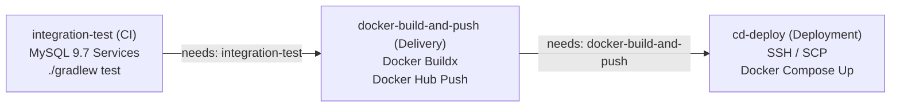

# **GitHub Actions 기반의 지속적 제공(Continuous Delivery)**

## **1. 지속적 제공(Delivery) 정의 및 도커 레지스트리 아키텍처**

- 지속적 제공(Continuous Delivery)은 CI 단계를 통과한 소스코드를 언제든 운영 환경에 배포할 수 있는 상태의 완제품(Docker Image)으로 자동 패키징하여, 중앙 저장소인 컨테이너 레지스트리3 (Container Registry)에 안전하게 적재하는 프로세스.
- 로컬 또는 러너에서 빌드된 도커 이미지를 안전하게 보관하고, 원격 운영 서버(EC2)에서 즉시 내려받을 수 있도록 Docker Hub 등 중앙 레지스트리와 연동하는 파이프라인을 수립함.

## **2. Docker Hub 연동 및 이미지 빌드/푸시 파이프라인 구축**

- Gradle 빌드 스텝(`setup-java`, `./gradlew build`)이 생략된 이유
    - 1단원의 CI 워크플로우(`01_ci.yaml`)에서는 러너 환경에 직접 JDK를 설치하고 `./gradlew clean build`를 실행하여 컴파일 및 아티팩트 생성을 수행함.
    - 반면 본 워크플로우에서는 프로젝트 루트의 `Dockerfile`이 멀티 스테이지 빌드(Multi-stage Build) 구조로 작성되어 있어, 도커 빌드 과정 1단계(`AS builder`) 내부에서 Gradle Wrapper와 소스코드를 복사하여 자체적으로 `./gradlew bootJar` 빌드를 수행함.
    - 따라서 러너에 별도의 Java 런타임을 구성하지 않아도 `docker/build-push-action` 단일 액션만으로 소스 컴파일, JAR 패키징, 런타임 이미지 생성이 완결되므로 파이프라인 단계가 간소화되고 환경 독립성이 보장됨.

### **2.1 지속적 제공(Continuous Delivery) 워크플로우 작성**

- 저장소 내 `.github/workflows/02_delivery.yaml` 경로에 파일을 생성하고 아래와 같이 파이프라인을 정의.

    ```yaml
    name: 02 Delivery Pipeline
    
    on:
      push:
        branches: [ "main" ]
    
    jobs:
      docker-build-and-push:
        name: Docker Image Build and Push
        runs-on: ubuntu-latest
    
        steps:
          - name: 1. 소스코드 체크아웃
            uses: actions/checkout@v7
    
          - name: 2. Docker Buildx 설정 (멀티 플랫폼 빌드 지원 도구)
            uses: docker/setup-buildx-action@v4
    
          - name: 3. Docker Hub 로그인 인증
            uses: docker/login-action@v4
            with:
              username: ${{ secrets.DOCKERHUB_USERNAME }}
              password: ${{ secrets.DOCKERHUB_TOKEN }}
    
          - name: 4. Docker 이미지 빌드 및 Docker Hub 자동 푸시
            uses: docker/build-push-action@v7
            with:
              context: .
              file: ./Dockerfile
              push: true
              tags: |
                ${{ secrets.DOCKERHUB_USERNAME }}/mybatis-sns:latest
                ${{ secrets.DOCKERHUB_USERNAME }}/mybatis-sns:${{ github.sha }}
              cache-from: type=gha
              cache-to: type=gha,mode=max
    ```


### **2.2 워크플로우 핵심 액션 분석**

#### **1) docker/setup-buildx-action@v4**

- 액션 저장소: docker/setup-buildx-action
- Docker 공식 확장 빌드 툴킷인 Buildx(Moby BuildKit 엔진 기반) 환경을 러너에 설정하여 캐시 최적화(`type=gha`) 및 멀티 플랫폼 아키텍처 빌드 기능을 활성화함.

#### **2) docker/login-action@v4**

- 액션 저장소: docker/login-action
- Docker Hub 또는 프라이빗 컨테이너 레지스트리32에 안전하게 로그인 인증을 수행하여 빌드된 이미지를 푸시할 수 있는 세션 자격을 획득함.

#### **3) docker/build-push-action@v7**

- 액션 저장소: docker/build-push-action
- Docker Buildx 환경을 기반으로 Dockerfile을 해석하여 컨테이너 이미지를 빌드하고 지정된 태그로 원격 레지스트리에 자동 푸시하는 Docker 공식 통합 배포 액션.

## **3. 이미지 태그 전략 및 Docker Hub 아티팩트 검증**

### **3.1 이미지 태그 전략**

#### **1) latest 태그**

- 가장 최근에 배포된 최신 버전의 이미지를 가리키는 포인터 역할.
- 운영 서버에서 `docker compose pull` 명령어로 최신 이미지를 선별하여 즉시 다운로드할 때 활용됨.

#### **2) Commit SHA 기반 고유 태그 (`github.sha`)**

- 깃 커밋 고유 해시 식별자를 태그로 함께 부여(예: `mybatis-sns:a1b2c3d`).
- 일상적인 개발 과정에서 커밋이 푸시될 때마다 소스코드 스냅샷과 배포 이미지를 1:1로 정확하게 매핑.
- 운영 환경에서 배포 장애가 발생했을 때 문제가 없던 이전 커밋 버전으로 즉각 롤백(Rollback)할 수 있는 추적성 확보.

#### **3) 정식 릴리즈 시맨틱 버저닝 태그 (`v1.0.0`, `v1.0`, `v1`)**

- 도커 기초 단원에서 학습한 시맨틱 버저닝(Semantic Versioning) 다중 태깅 전략과의 관계
    - 일상적인 지속적 배포(CD) 파이프라인: 커밋 변경이 빈번한 웹 서비스 특성상 매번 작업자가 버전을 올리기 어려우므로 `latest`와 `github.sha` 조합을 실무 표준으로 사용함.
    - 정식 릴리즈 배포 파이프라인: 정기 배포나 마일스톤 출시 시점에는 Git 태그 이벤트(`on: push: tags: [ 'v*.*.*' ]`)를 별도로 트리거하여 `v1.0.0`, `v1.0`, `v1` 형태의 메이저/마이너 다중 태그 이미지를 공식 아카이빙 목적으로 빌드 및 보관함.

### **3.2 지속적 제공(Continuous Delivery) 검증 및 이미지 등록 확인**

- 작성한 `02_delivery.yaml` 파일을 커밋하고 원격 저장소에 푸시하여 지속적 제공 파이프라인이 정상 동작하는지 점검.
- GitHub Actions 탭에서 `Docker Image Build and Push` 작업이 정상 완료(초록색 체크) 되었는지 확인.
- Docker Hub 웹 콘솔의 저장소(Repositories) 페이지로 이동하여 `latest` 태그 및 커밋 해시 태그가 부여된 새 이미지가 등록되었는지 확인.

# **AWS EC2 기반의 지속적 배포(Continuous Deployment)**

## **1. 지속적 배포(Deployment) 정의 및 클라우드 배포 전략**

- 지속적 배포(Continuous Deployment)는 지속적 제공(Continuous Delivery) 단계를 통해 레지스트리에 적재된 완성형 도커 이미지를, 사람의 수동 개입 없이 실제 운영 클라우드 인프라(AWS EC2)에 무인으로 전달하고 가동시키는 프로세스.
- AWS EC2 환경 구성
    - 서버 내부에는 Docker 엔진이 설치되어 실행 중이어야 하며, 웹 트래픽(HTTP 80) 및 SSH(22) 포트가 AWS 보안 그룹(Security Group) 인바운드 규칙에 개방되어 있어야 함.
- 전체 배포 흐름 구조도
    - 개발자가 Git Push 수행.
    - GitHub Actions 러너가 Dockerfile 기반으로 소스코드를 빌드하고 Docker Hub로 이미지 푸시 (Continuous Delivery).
    - GitHub Actions가 SSH 프로토콜을 통해 AWS EC2 서버에 원격 접속.
    - EC2 서버 내부에서 Docker Compose 명령어를 실행하여 최신 이미지를 pull받고 기존 컨테이너를 안전하게 교체 실행 (Continuous Deployment).

## **2. GitHub Secrets 기반 EC2 보안 환경 변수 관리**

- 데이터베이스 비밀번호, JWT 암호화 비밀키, AWS 접속 정보, 개인 비밀키 등 민감한 자격 증명(Credentials)을 Git 소스코드에 하드코딩하면 유출의 위험이 발생.
- GitHub는 이러한 민감 정보를 비대칭 암호화 기법으로 안전하게 보호하는 GitHub Actions Secrets 기능을 제공함.

### **2.1 GitHub Secrets 등록 항목**

- GitHub 저장소 상단 메뉴의 Settings -> Secrets and variables -> Actions 경로에서 `New repository secret` 버튼을 클릭하여 등록함.
- `DOCKERHUB_USERNAME`과 `DOCKERHUB_TOKEN`은 2단원에서 사전 등록을 마쳤으므로, EC2 원격 접속 및 애플리케이션 운영에 필요한 시크릿 항목들을 추가 등록함.

#### **1) EC2 원격 접속 인프라 시크릿**

- Github Actions 에서 사용할 환경 변수 등록

| **시크릿 변수명** | **설정 값 및 용도 설명** | **비고** |
| --- | --- | --- |
| `DOCKERHUB_USERNAME` | Docker Hub 로그인 계정 ID | 등록 완료 |
| `DOCKERHUB_TOKEN` | Docker Hub 웹에서 발급받은 Personal Access Token | 등록 완료 |
| `EC2_HOST` | AWS EC2 인스턴스의 퍼블릭 IPv4 주소 또는 탄력적 IP(Elastic IP) | 신규 등록 |
| `EC2_USERNAME` | EC2 인스턴스 기본 접속 사용자명 (`ec2-user`) | 신규 등록 |
| `EC2_SSH_KEY` | AWS에서 발급받은 개인 접속 비밀키 (`.pem` 파일의 전체 텍스트) | 신규 등록 |

#### **2) EC2 애플리케이션 운영 보안 환경 변수 시크릿**

- EC2 인스턴스 내에서 실행되는 Spring Boot 컨테이너 구동에 필요한 실제 운영 보안 값 등록.

| **시크릿 변수명** | **설정 값 및 용도 설명** | **예시 값** |
| --- | --- | --- |
| `JWT_SECRET` | 토큰 서명 및 검증용 대칭키 (Base64 인코딩 256비트 이상) | `.env 값 지정` |
| `GOOGLE_CLIENT_ID` | Google Cloud Console에서 발급받은 OAuth2 클라이언트 ID | `.env 값 지정` |
| `GOOGLE_CLIENT_SECRET` | Google Cloud Console에서 발급받은 OAuth2 클라이언트 보안 비밀 | `.env 값 지정` |
| `KAKAO_CLIENT_ID` | Kakao Developers에서 발급받은 REST API 키 | `.env 값 지정` |
| `KAKAO_CLIENT_SECRET` | Kakao Developers에서 발급받은 Client Secret 보안 코드 | `.env 값 지정` |

#### **3) 데이터베이스 접속 및 초기화 시크릿**

- EC2 인스턴스 내에서 실행되는 MySQL 컨테이너 구동에 필요한 공통 데이터베이스 환경 변수 등록.

| **시크릿 변수명** | **설정 값 및 용도 설명** | **예시 값** |
| --- | --- | --- |
| `MYSQL_DATABASE` | 데이터베이스 명칭 | `.env 값 지정` |
| `MYSQL_ROOT_PASSWORD` | MySQL 관리자(root) 패스워드 | `.env 값 지정` |
| `MYSQL_USER` | 애플리케이션 접속용 일반 계정 | `.env 값 지정` |
| `MYSQL_PASSWORD` | 애플리케이션 접속용 패스워드 | `.env 값 지정` |

## **3. SSH 및 Docker Compose 기반 원격 자동 배포 연동 및 파이프라인 완성**

- GitHub Actions 워크플로우에서 오픈소스 액션인 `appleboy/scp-action`과 `appleboy/ssh-action`을 활용하여 배포 명세서를 동기화하고 원격 배포 명령을 실행.
- 프로젝트 루트의 `docker-compose.yaml` 파일이 Git 저장소에 커밋되어 있어야 하며, 배포 파이프라인 실행 시 EC2 서버의 홈 디렉터리로 자동 전송됨.
- Docker Compose의 선언적 명세를 바탕으로, 복잡한 쉘 스크립트와 긴 `docker run` 명령어를 대체하여 간결하고 안정적인 서비스 구동 환경을 수립.

### **3.1 지속적 배포(Continuous Deployment) 워크플로우 작성**

- AWS EC2 원격 서버에 접속하여 컨테이너를 갱신 배포하는 `cd-deploy` 독립 워크플로우를 구성.
- 저장소 내 `.github/workflows/03_deployment.yaml` 경로에 파일을 생성하고 아래와 같이 배포 파이프라인을 정의.

```yaml
name: 03 Deployment Pipeline

on:
  push:
    branches: [ "main" ]

jobs:
  cd-deploy:
    name: Continuous Deployment to AWS EC2
    runs-on: ubuntu-latest

    steps:
      - name: 소스코드 체크아웃
        uses: actions/checkout@v7

      - name: docker-compose.yaml 파일을 EC2로 전송
        uses: appleboy/scp-action@v1.0.0
        with:
          host: ${{ secrets.EC2_HOST }}
          username: ${{ secrets.EC2_USERNAME }}
          key: ${{ secrets.EC2_SSH_KEY }}
          source: "docker-compose.yaml"
          target: "/home/ec2-user"

      - name: SSH를 통한 EC2 원격 접속 및 Docker Compose 배포 실행
        uses: appleboy/ssh-action@v1.2.5
        with:
          host: ${{ secrets.EC2_HOST }}
          username: ${{ secrets.EC2_USERNAME }}
          key: ${{ secrets.EC2_SSH_KEY }}
          script: |
            set -e
            cd /home/ec2-user
            echo ">>> 1. GitHub Secrets 기반 운영 환경 변수(.env) 자동 동기화"
            cat << 'EOF' > .env
            DB_HOST=mysql
            DB_PORT=3306
            MYSQL_DATABASE=${{ secrets.MYSQL_DATABASE }}
            MYSQL_ROOT_PASSWORD=${{ secrets.MYSQL_ROOT_PASSWORD }}
            MYSQL_USER=${{ secrets.MYSQL_USER }}
            MYSQL_PASSWORD=${{ secrets.MYSQL_PASSWORD }}
            SPRING_DATASOURCE_USERNAME=${{ secrets.MYSQL_USER }}
            SPRING_DATASOURCE_PASSWORD=${{ secrets.MYSQL_PASSWORD }}
            JWT_SECRET=${{ secrets.JWT_SECRET }}
            GOOGLE_CLIENT_ID=${{ secrets.GOOGLE_CLIENT_ID }}
            GOOGLE_CLIENT_SECRET=${{ secrets.GOOGLE_CLIENT_SECRET }}
            KAKAO_CLIENT_ID=${{ secrets.KAKAO_CLIENT_ID }}
            KAKAO_CLIENT_SECRET=${{ secrets.KAKAO_CLIENT_SECRET }}
            EOF

            echo ">>> 2. 최신 Docker 이미지 다운로드"
            docker compose pull mybatis-sns-app

            echo ">>> 3. 컨테이너 갱신 및 백그라운드 구동"
            docker compose up -d

            echo ">>> 4. 사용되지 않는 구버전 이미지 정리"
            docker image prune -f

            echo ">>> Docker Compose 기반 배포 프로세스가 정상 완료되었습니다."
```

### **3.2 원격 배포 액션 분석**

#### **1) appleboy/scp-action@v1.0.0**

- 액션 저장소: appleboy/scp-action
- SSH 프로토콜 기반의 보안 파일 전송(SCP) 액션으로, 로컬 워크스페이스의 배포 명세서(`docker-compose.yaml`)를 원격 AWS EC2 인스턴스의 대상 디렉터리로 복사.

#### **2) appleboy/ssh-action@v1.2.5**

- 액션 저장소: appleboy/ssh-action
- 원격 서버에 SSH 세션을 맺고 `script` 블록에 선언된 쉘 명령어를 직접 실행하여 최신 이미지 pull 및 컨테이너 갱신(`docker compose up -d`)을 자동화하는 액션.
- 스크립트 최상단에 `set -e`를 선언하여 도커 명령어 실패 등 중간 단계 오류 발생 시 즉시 실행을 중단하고 워크플로우를 실패(Exit Code 1)로 처리하도록 안전장치를 적용.

## **4. 배포 상태 최종 검증**

- EC2 콘솔에 접속하여 아래 명령어로 배포된 다중 컨테이너의 구동 상태 및 애플리케이션 로그를 점검함.

```bash
# 1. Docker Compose 다중 컨테이너 실행 상태 점검 (mybatis-sns-app, mybatis-sns-db 확인)
docker compose ps

# 2. mybatis-sns-app 애플리케이션의 실시간 스프링 부트 구동 로그 확인
docker compose logs -f mybatis-sns-app

# 3. 로컬 호스트 및 외부 브라우저 접속 테스트 (80 포트)
curl -I http://localhost/api/v1/posts
```

# **GitHub Actions Services 기반 데이터베이스 연동 테스트**

## **1. Services 컨테이너 동작 메커니즘 및 필요성**

- 1단원 CI의 한계와 데이터베이스 연동 테스트 필요성
    - 앞서 1단원의 기본 CI 파이프라인에서는 러너에 데이터베이스 환경이 갖춰지지 않아 `x test` 옵션으로 테스트를 건너뛰고 컴파일 및 패키징 무결성만 검증함.
    - 하지만 비즈니스 로직과 데이터 액세스 계층(MyBatis Mapper)이 올바르게 동작하는지 온전히 검증하려면 실제 데이터베이스가 구동 중인 환경에서의 통합 테스트가 반드시 필요함.
- 외부에 상시 구동되는 테스트용 DB 서버를 둘 경우 발생하는 문제점
    - 여러 개발자가 동시에 PR을 올리거나 커밋을 푸시할 때 데이터 간섭 및 충돌(Race Condition) 발생.
    - 테스트만을 위해 24시간 클라우드 DB 인스턴스를 유지해야 하므로 불필요한 인프라 비용 발생.
    - 외부 러너 접속을 위해 DB 포트(3306)를 외부망에 상시 개방해야 하는 보안 취약점 초래.
- GitHub Actions Services 솔루션
    - 러너 가상 머신 내부에 도커 컨테이너로 데이터베이스를 일회용으로 기동하는 기능.
    - 워크플로우 실행 시점에만 백그라운드로 구동되고, 테스트 완료 후 러너와 함께 자동으로 소멸하므로 비용이 발생하지 않고 안전한 데이터 격리를 보장함.

## **2. GitHub Secrets 기반 데이터베이스 보안 환경 변수 관리**

- 워크플로우 파일(`.github/workflows/*.yaml`)은 Git 저장소에 커밋되어 공개되므로, 데이터베이스 계정 및 패스워드를 절대 코드 내에 평문으로 하드코딩해서는 안 됨.
- 본 실습 및 향후 배포 파이프라인에서 사용할 데이터베이스 시크릿 4종(`MYSQL_DATABASE`, `MYSQL_ROOT_PASSWORD`, `MYSQL_USER`, `MYSQL_PASSWORD`)은 앞서 3.2.1절에서 일괄 사전 등록을 완료하였으므로, 워크플로우 정의 시 바로 참조하여 사용함.

## **3. MySQL 9.7 Services 연동 및 테스트 워크플로우 구축**

- 저장소 내 `.github/workflows/04_ci_test.yaml` 경로에 파일을 생성하고 워크플로우를 정의함.
- `services` 블록을 정의하여 `mysql:9.7` 이미지를 기동하고, 헬스체크(`mysqladmin ping`)를 설정하여 DB 준비 완료 후 테스트를 수행하도록 구성함.

```yaml
name: 04 Integration Test Pipeline

on:
  push:
    branches: [ "feature/**" ]
  pull_request:
    branches: [ "main" ]

jobs:
  integration-test:
    name: Run Tests with MySQL 9.7 Service
    runs-on: ubuntu-latest

    # 러너 내부에서 독립적으로 실행되는 일회용 MySQL 서비스 컨테이너
    services:
      mysql:
        image: mysql:9.7
        env:
          MYSQL_ROOT_PASSWORD: ${{ secrets.MYSQL_ROOT_PASSWORD }}
          MYSQL_DATABASE: ${{ secrets.MYSQL_DATABASE }}
          MYSQL_USER: ${{ secrets.MYSQL_USER }}
          MYSQL_PASSWORD: ${{ secrets.MYSQL_PASSWORD }}
        ports:
          - 3306:3306
        options: --health-cmd="mysqladmin ping" --health-interval=10s --health-timeout=5s --health-retries=3

    steps:
      - name: 1. 소스코드 체크아웃
        uses: actions/checkout@v7

      - name: 2. Java 25 환경 설정 및 Gradle 캐시
        uses: actions/setup-java@v6
        with:
          java-version: '25'
          distribution: 'temurin'
          cache: 'gradle'

      - name: 3. Gradle Wrapper 실행 권한 부여
        run: chmod +x gradlew

      - name: 4. 단위 및 통합 테스트 수행
        run: ./gradlew test
        env:
          SPRING_DATASOURCE_URL: jdbc:mysql://localhost:3306/${{ secrets.MYSQL_DATABASE }}
          SPRING_DATASOURCE_USERNAME: ${{ secrets.MYSQL_USER }}
          SPRING_DATASOURCE_PASSWORD: ${{ secrets.MYSQL_PASSWORD }}
          # 3.2.1절에서 등록한 보안 시크릿 환경 변수 주입
          GOOGLE_CLIENT_ID: ${{ secrets.GOOGLE_CLIENT_ID }}
          GOOGLE_CLIENT_SECRET: ${{ secrets.GOOGLE_CLIENT_SECRET }}
          KAKAO_CLIENT_ID: ${{ secrets.KAKAO_CLIENT_ID }}
          KAKAO_CLIENT_SECRET: ${{ secrets.KAKAO_CLIENT_SECRET }}
          JWT_SECRET: ${{ secrets.JWT_SECRET }}
```

### **3.1 워크플로우 동작 메커니즘 분석**

- `services.mysql`: GitHub Actions 러너가 시작될 때 도커 명령어를 내부적으로 호출하여 `mysql:9.7` 컨테이너를 백그라운드 데몬으로 실행함.
- `options.health-cmd`: MySQL 데몬이 완전히 초기화되어 연결을 수락할 준비가 될 때까지 다음 Step 실행을 대기시킴으로써 `Communications link failure` 오류를 방지함.
- `SPRING_DATASOURCE_*`: 스프링 부트의 환경 변수 바인딩 규칙을 활용하여 `application.yaml` 설정을 덮어쓰고, Secrets로 주입된 계정 정보를 통해 로컬 MySQL 컨테이너(`localhost:3306`)에 안전하게 접속함.

# **완전 자동화 CI/CD 통합 파이프라인 구축**

## **1. 파이프라인 의존성 제어 아키텍처 (needs)**

- 파이프라인 3단계 연계 메커니즘
    - 1단계 지속적 통합 (CI): GitHub Actions Services 기반으로 MySQL 9.7을 기동하여 단위 및 통합 테스트 무결성을 검증함.
    - 2단계 지속적 제공 (Continuous Delivery): 테스트 통과 시에만 Docker Buildx로 이미지를 빌드하고 Docker Hub 레지스트리에 푸시함.
    - 3단계 지속적 배포 (Continuous Deployment): 이미지 푸시 성공 시에만 SSH 프로토콜로 AWS EC2에 접속하여 Docker Compose로 무인 원격 배포를 수행함.
- needs 키워드를 활용한 작업 간 순차적 의존성 수립
    - 기본적으로 GitHub Actions의 Job들은 가용 러너 자원이 허용하는 한 병렬(Parallel)로 동시 실행됨.
    - 하지만 완전 자동화 배포 파이프라인에서는 테스트에 결함이 있는 코드가 배포되거나 이미지가 생성되기도 전에 EC2 배포가 시도되는 치명적인 오류를 방지하기 위해 엄격한 순서 보장이 필수적임.
    - `needs: integration-test`: 단위/통합 테스트 Job이 성공(Exit Code 0)으로 종료되어야만 이미지 빌드 작업이 트리거됨.
    - `needs: docker-build-and-push`: 이미지가 레지스트리에 정상 등록되어야만 EC2 배포 작업이 트리거됨.



## **2. mybatis-sns 통합 CI/CD 파이프라인 완성**

- 이전 워크플로우 비활성화(Disable Workflow) 안내
    - `05_cicd_full.yaml` 파일은 테스트부터 빌드, 푸시, EC2 원격 배포까지 전 과정을 포함하므로, 이전에 작성한 `01_ci.yaml`, `02_delivery.yaml`, `03_deployment.yaml`, `04_ci_test.yaml`이 켜져 있으면 동일한 커밋 푸시 이벤트 발생 시 중복 실행되어 리소스 낭비 및 배포 충돌을 초래할 수 있음.
    - GitHub 저장소 상단 Actions 탭에서 이전 워크플로우들을 선택하고 우측 상단의 `...` (옵션) 버튼 -> `Disable workflow`를 클릭하여 비활성화한 뒤 본 완전체 파이프라인을 구동함.
- 저장소 내 `.github/workflows/05_cicd_full.yaml` 경로에 파일을 생성하고 아래와 같이 파이프라인을 정의함.

```yaml
name: 05 Full CI/CD Pipeline

on:
  push:
    branches: [ "main" ]

jobs:
  # 1. 지속적 통합 (CI) - 4단원 Services 컨테이너 기반 단위/통합 테스트
  integration-test:
    name: Run Tests with MySQL 9.7 Service
    runs-on: ubuntu-latest

    services:
      mysql:
        image: mysql:9.7
        env:
          MYSQL_ROOT_PASSWORD: ${{ secrets.MYSQL_ROOT_PASSWORD }}
          MYSQL_DATABASE: ${{ secrets.MYSQL_DATABASE }}
          MYSQL_USER: ${{ secrets.MYSQL_USER }}
          MYSQL_PASSWORD: ${{ secrets.MYSQL_PASSWORD }}
        ports:
          - 3306:3306
        options: --health-cmd="mysqladmin ping" --health-interval=10s --health-timeout=5s --health-retries=3

    steps:
      - name: 1. 소스코드 체크아웃
        uses: actions/checkout@v7

      - name: 2. Java 25 환경 설정 및 Gradle 캐시
        uses: actions/setup-java@v6
        with:
          java-version: '25'
          distribution: 'temurin'
          cache: 'gradle'

      - name: 3. Gradle Wrapper 실행 권한 부여
        run: chmod +x gradlew

      - name: 4. 단위 및 통합 테스트 수행
        run: ./gradlew test
        env:
          SPRING_DATASOURCE_URL: jdbc:mysql://localhost:3306/${{ secrets.MYSQL_DATABASE }}
          SPRING_DATASOURCE_USERNAME: ${{ secrets.MYSQL_USER }}
          SPRING_DATASOURCE_PASSWORD: ${{ secrets.MYSQL_PASSWORD }}
          # 3.2.1절에서 등록한 보안 시크릿 환경 변수 주입
          GOOGLE_CLIENT_ID: ${{ secrets.GOOGLE_CLIENT_ID }}
          GOOGLE_CLIENT_SECRET: ${{ secrets.GOOGLE_CLIENT_SECRET }}
          KAKAO_CLIENT_ID: ${{ secrets.KAKAO_CLIENT_ID }}
          KAKAO_CLIENT_SECRET: ${{ secrets.KAKAO_CLIENT_SECRET }}
          JWT_SECRET: ${{ secrets.JWT_SECRET }}

  # 2. 지속적 제공 (Continuous Delivery) - 2단원 Docker Hub 이미지 빌드 및 푸시
  docker-build-and-push:
    name: Docker Image Build and Push
    needs: integration-test
    runs-on: ubuntu-latest

    steps:
      - name: 1. 소스코드 체크아웃
        uses: actions/checkout@v7

      - name: 2. Docker Buildx 설정
        uses: docker/setup-buildx-action@v4

      - name: 3. Docker Hub 로그인 인증
        uses: docker/login-action@v4
        with:
          username: ${{ secrets.DOCKERHUB_USERNAME }}
          password: ${{ secrets.DOCKERHUB_TOKEN }}

      - name: 4. Docker 이미지 빌드 및 Docker Hub 자동 푸시
        uses: docker/build-push-action@v7
        with:
          context: .
          file: ./Dockerfile
          push: true
          tags: |
            ${{ secrets.DOCKERHUB_USERNAME }}/mybatis-sns:latest
            ${{ secrets.DOCKERHUB_USERNAME }}/mybatis-sns:${{ github.sha }}
          cache-from: type=gha
          cache-to: type=gha,mode=max

  # 3. 지속적 배포 (Continuous Deployment) - 이미지 푸시 성공 시 AWS EC2 원격 갱신 배포
  cd-deploy:
    name: Continuous Deployment to AWS EC2
    needs: docker-build-and-push
    runs-on: ubuntu-latest

    steps:
      - name: 소스코드 체크아웃
        uses: actions/checkout@v7

      - name: docker-compose.yaml 파일을 EC2로 전송
        uses: appleboy/scp-action@v1.0.0
        with:
          host: ${{ secrets.EC2_HOST }}
          username: ${{ secrets.EC2_USERNAME }}
          key: ${{ secrets.EC2_SSH_KEY }}
          source: "docker-compose.yaml"
          target: "/home/ec2-user"

      - name: SSH를 통한 EC2 원격 접속 및 Docker Compose 배포 실행
        uses: appleboy/ssh-action@v1.2.5
        with:
          host: ${{ secrets.EC2_HOST }}
          username: ${{ secrets.EC2_USERNAME }}
          key: ${{ secrets.EC2_SSH_KEY }}
          script: |
            set -e
            cd /home/ec2-user
            echo ">>> 1. GitHub Secrets 기반 운영 환경 변수(.env) 자동 동기화"
            cat << 'EOF' > .env
            DB_HOST=mysql
            DB_PORT=3306
            MYSQL_DATABASE=${{ secrets.MYSQL_DATABASE }}
            MYSQL_ROOT_PASSWORD=${{ secrets.MYSQL_ROOT_PASSWORD }}
            MYSQL_USER=${{ secrets.MYSQL_USER }}
            MYSQL_PASSWORD=${{ secrets.MYSQL_PASSWORD }}
            SPRING_DATASOURCE_USERNAME=${{ secrets.MYSQL_USER }}
            SPRING_DATASOURCE_PASSWORD=${{ secrets.MYSQL_PASSWORD }}
            JWT_SECRET=${{ secrets.JWT_SECRET }}
            GOOGLE_CLIENT_ID=${{ secrets.GOOGLE_CLIENT_ID }}
            GOOGLE_CLIENT_SECRET=${{ secrets.GOOGLE_CLIENT_SECRET }}
            KAKAO_CLIENT_ID=${{ secrets.KAKAO_CLIENT_ID }}
            KAKAO_CLIENT_SECRET=${{ secrets.KAKAO_CLIENT_SECRET }}
            EOF

            echo ">>> 2. 최신 Docker 이미지 다운로드"
            docker compose pull mybatis-sns-app

            echo ">>> 3. 컨테이너 갱신 및 백그라운드 구동"
            docker compose up -d

            echo ">>> 4. 사용되지 않는 구버전 이미지 정리"
            docker image prune -f

            echo ">>> Docker Compose 기반 배포 프로세스가 정상 완료되었습니다."
```

## **3. End-to-End 배포 파이프라인 동작 검증**

- 테스트 실패 시 차단(Fail-Fast) 검증: 테스트 코드에 의도적으로 오류를 내고 커밋을 푸시했을 때, `test` Job에서 즉시 실패하여 후속 `docker-build-and-push`와 `cd-deploy`가 실행 취소(Skipped)되는지 확인.
- 정상 배포 파이프라인 검증: 모든 테스트 통과 시 3개 Job이 순차적으로 초록색 체크로 완료되고, EC2 서버에 최신 컨테이너가 무중단으로 갱신 반영되는지 확인.